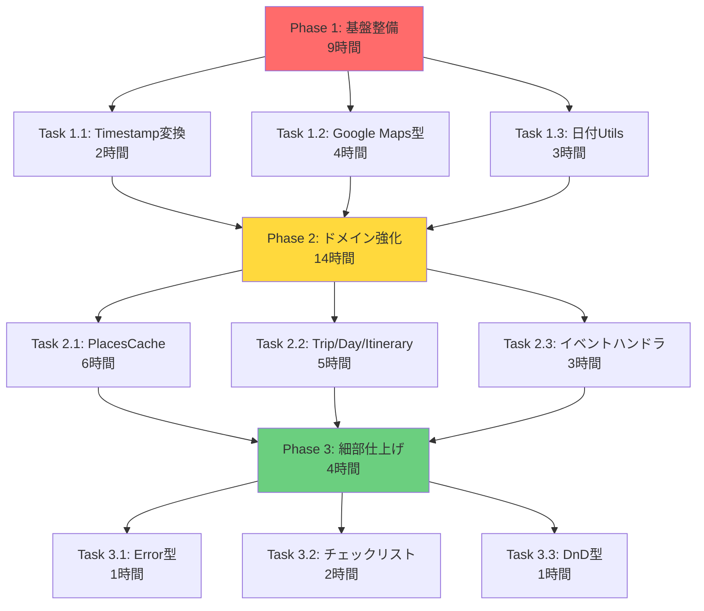

# 型安全性改善 - クイックサマリー

## 📊 全体統計

- **検出された `as any`**: 90箇所
- **検出された `: any`**: 244箇所
- **合計**: 334箇所
- **推定修正時間**: 27時間
- **技術的負債度**: ★★★★☆

---

## 🎯 優先順位トップ3

| 順位 | タスク | 箇所数 | 工数 | 理由 |
|------|--------|--------|------|------|
| 1️⃣ | Firestoreタイムスタンプ変換 | 30 | 2時間 | ✅ 既存ユーティリティあり<br>✅ 影響範囲が広い<br>✅ 実行時エラーのリスク高 |
| 2️⃣ | Google Maps API型定義 | 20 | 4時間 | ✅ `@types/google.maps`活用可能<br>✅ 型推論が効くようになる<br>✅ 他のタスクの基盤 |
| 3️⃣ | 日付ユーティリティ関数 | 15 | 3時間 | ✅ 中央集約された関数群<br>✅ ジェネリクスで型推論改善<br>✅ 広範囲に影響 |

---

## 🚀 クイックスタートガイド

### Step 1: Firestoreタイムスタンプ変換（2時間）

**置き換え対象**:
```typescript
// ❌ これを探す
(date as any).toDate()
new Date(date as any)
```

**置き換え方法**:
```typescript
// ✅ これに置き換え
import { toDate, toDateOrNull } from '@/lib/firebase/timestamp-utils'

const d = toDate(date)           // 確実に存在する場合
const d = toDateOrNull(date)     // nullの可能性がある場合
```

**主な対象ファイル**:
- `components/trip/TripItineraryView.tsx`
- `components/planner/NavigationMenu.tsx`
- `components/stats/TripReservationDisplay.tsx`
- `components/modals/ReservationInfoModal.tsx`

### Step 2: Google Maps API型定義（4時間）

**新規作成**:
```bash
# 型定義ファイルを作成
touch lib/core/types/google-maps.ts
```

**基本的な置き換え**:
```typescript
// ❌ Before
interface MapProps {
  google: any
}

// ✅ After
import type { GoogleMapsAPI } from '@/lib/core/types/google-maps'

interface MapProps {
  google: GoogleMapsAPI
}
```

**主な対象ファイル**:
- `components/tripcard/NextTripMap.tsx`
- `components/trip/TripMap.tsx`
- `components/trip/CountryMap.tsx`

### Step 3: 日付ユーティリティ関数（3時間）

**置き換え対象**:
```typescript
// ❌ Before
isValidDate: (date: any): boolean => { }
formatDate: (date: any): string => { }
sortTripsByDate: (trips: any[]): { futureTrips: any[], pastTrips: any[] } => { }
```

**置き換え方法**:
```typescript
// ✅ After
import type { FirestoreDate, Trip } from '@/lib/core/types'

isValidDate: (date: FirestoreDate | null | undefined): boolean => { }
formatDate: (date: FirestoreDate): string => { }
sortTripsByDate: <T extends Trip>(trips: T[]): { futureTrips: T[], pastTrips: T[] } => { }
```

**対象ファイル**:
- `lib/utils/date.ts`（1ファイル、約15関数）

---

## 📝 実装時のチェックリスト

### 開始前
- [ ] ブランチを作成: `git checkout -b feature/type-safety-improvements`
- [ ] 現在のコードが正常に動作することを確認
- [ ] 型チェックの現状を確認: `npm run type-check`

### 各タスク実施時
- [ ] 小さな単位で変更（1ファイルずつ推奨）
- [ ] 変更後に型チェック: `npx tsc --noEmit <ファイル名>`
- [ ] コミット: `git commit -m "fix: improve type safety in <ファイル名>"`
- [ ] ビルドテスト: `npm run build`

### 完了後
- [ ] すべての型エラーが解消されたことを確認
- [ ] ビルドが通ることを確認
- [ ] 実際の動作確認（開発サーバーで動作テスト）
- [ ] プルリクエスト作成

---

## 🎨 よくある置き換えパターン

### パターン1: Firestore Timestamp

```typescript
// ❌ Before
const date = (doc.date as any).toDate()

// ✅ After
import { toDate } from '@/lib/firebase/timestamp-utils'
const date = toDate(doc.date)
```

### パターン2: Google Maps イベント

```typescript
// ❌ Before
map.addListener('click', (event: any) => {
  const lat = event.latLng.lat()
})

// ✅ After
map.addListener('click', (event: google.maps.MapMouseEvent) => {
  const lat = event.latLng?.lat() ?? 0
})
```

### パターン3: フォーム入力

```typescript
// ❌ Before
setForm((prev: any) => ({ ...prev, value: e.target.value }))

// ✅ After
const handleChange = (e: React.ChangeEvent<HTMLInputElement>) => {
  setForm(prev => prev ? { ...prev, value: e.target.value } : null)
}
```

### パターン4: Catch句

```typescript
// ❌ Before
catch (error: any) {
  console.error(error.message)
}

// ✅ After
catch (error) {
  if (error instanceof Error) {
    console.error(error.message)
  } else {
    console.error('Unknown error:', error)
  }
}
```

### パターン5: 配列操作

```typescript
// ❌ Before
const sorted = items.sort((a: any, b: any) => a.value - b.value)

// ✅ After
interface SortableItem {
  value: number
}
const sorted = items.sort((a: SortableItem, b: SortableItem) => a.value - b.value)
```

---

## 🔍 検索コマンド

### `as any`を探す
```bash
grep -r "as any" --include="*.ts" --include="*.tsx" .
```

### `: any`を探す
```bash
grep -r ": any" --include="*.ts" --include="*.tsx" .
```

### 特定パターンを探す
```bash
# Firestore Timestamp変換
grep -r "(.*as any).toDate()" --include="*.tsx" .

# Google Maps API
grep -r "google: any" --include="*.tsx" .

# フォーム setState
grep -r "prev: any" --include="*.tsx" .
```

---

## ⚡ 推奨実装順序



---

## 📚 参考ドキュメント

1. **詳細な問題分析**: `docs/refactoring/type-safety-issues.md`
2. **実装ガイド**: `docs/refactoring/type-safety-migration-guide.md`
3. **既存の型定義**: `lib/core/types/`
4. **Firestoreユーティリティ**: `lib/firebase/timestamp-utils.ts`
5. **日付ユーティリティ**: `lib/utils/date.ts`

---

## 💡 重要な注意事項

### ⚠️ やってはいけないこと

1. **一度にすべてを修正しない**
   - 小さなPRに分割する
   - 各PR後にビルド＆テストを確認

2. **型定義を壊さない**
   - 既存のインターフェースは維持
   - 後方互換性を保つ

3. **テストをスキップしない**
   - 型チェックは必須
   - ビルドテストは必須
   - 実行時テストも実施

### ✅ やるべきこと

1. **段階的に進める**
   - Phase 1 → Phase 2 → Phase 3の順序を守る

2. **ドキュメントを更新**
   - 型定義の変更は必ずドキュメント化

3. **チームと共有**
   - 進捗をチームに報告
   - 問題があれば相談

---

## 🎯 成功の指標

- [ ] `as any`の使用箇所が90 → 0に削減
- [ ] `: any`の使用箇所が244 → 50以下に削減（妥当な使用のみ残す）
- [ ] 型チェックエラーが0件
- [ ] ビルドが成功
- [ ] すべての機能が正常動作

---

## 📞 困ったときは

1. `type-safety-migration-guide.md`のトラブルシューティングを確認
2. 該当ファイルの既存の型定義を確認
3. TypeScript公式ドキュメントを参照
4. チームメンバーに相談

---

**🚀 それでは、Phase 1のTask 1.1から始めましょう！**

